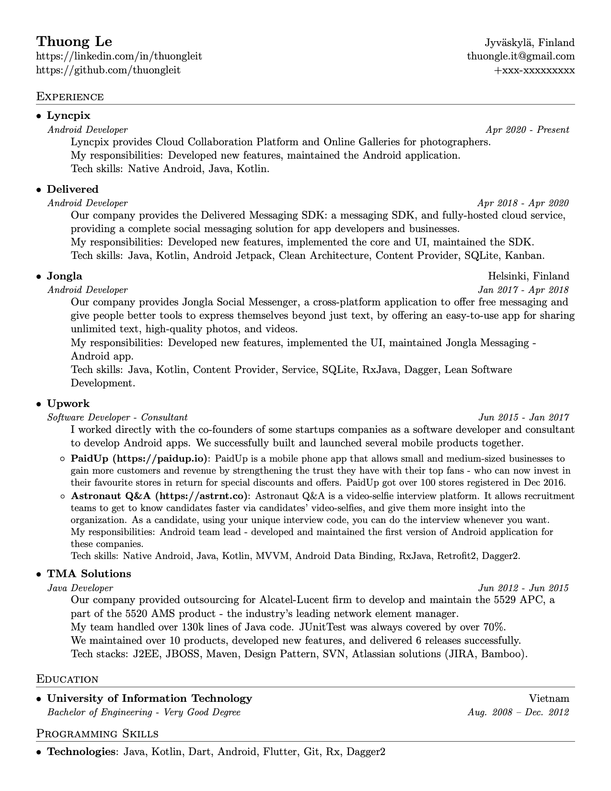
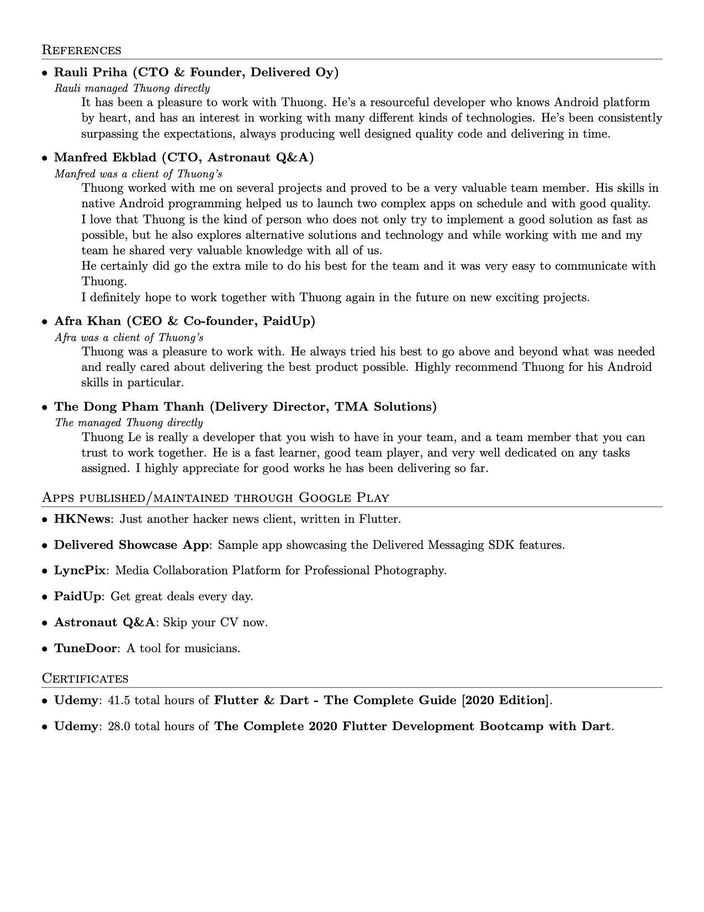

This is a fork from [sb2nov/resume](https://github.com/sb2nov/resume). I modified it for my personal needs.

### Introdution

The awesome introduction from the author:

> A single-page, one-column resume for software developers. It uses the base latex templates and fonts to provide ease of use and installation when trying to update the resume. The different sections are clearly documented and custom commands are used to provide consistent formatting.

### Motivation

I have the same motivation like author. I used Google Docs and even Adobe Illustrator to write my resume and realized it was hard to format and maintain. Latex makes pdf more elegant and a lot easier to maintain. 

### Setup and Compilation

#### macOS

I use [MacTex](https://www.tug.org/mactex/) to compile .tex file.

You can find the installation instruction [here](https://www.tug.org/mactex/mactex-download.html).

Or if you use Homebrew, you can install it via command:

```unix
brew install mactex

# or if you don't use GUI

brew install mactex-no-gui
```

#### Windows

You can use [MiKTeX](https://miktex.org/). You can find installion instruction [here](https://miktex.org/download/).

#### How to compile

Simply just run:

```unix
pdflatex <your_file>.tex
```

The resume will be generated to .pdf format as `<your_file>.pdf`.

### Preview




### License
Format is MIT, licensed and credited to [Sourabh Bajaj](https://github.com/sb2nov).

Modified and licensed to Thuong Le.
